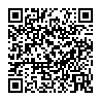

# Smartsheet QR Code Scanner

This is an Android application for scanning contact QRCodes and adding the contact info
as a row to a Smartsheet via the [Smartsheet REST API](https://www.smartsheet.com/developers).

## Demo

Demo available on Youtube.

## QR Code Formats

Currently the application supports QRCodes that encode contact information in the VCARD or MECARD
format.

Sample VCARD:

## Setup

The application needs to be able to save contacts to a Smartsheet via the Smartsheet API.

1. Setup a Smartsheet OAuth token.
1. Create a new Smartsheet under the same account.
1. Setup the column names on the sheet to match the fields you want to save.
1. Get the Smartsheet Sheet ID from the sheet properties screen.
1. Save the OAuth Token and Sheet ID in the settings of the scanner application.

### Smartsheet Columns

The following Smartsheet column names (case insensitive) are mapped from the QR code information.

* Name
* Email
* Organzation (or Org)
* Title
* QRCode (or Raw, or RawQRCode) - the raw QR code data

The raw QR code data is set even if the scanner is unable to identify and parse the format of the
QR code. This can be useful for troubleshooting unknown formats.
